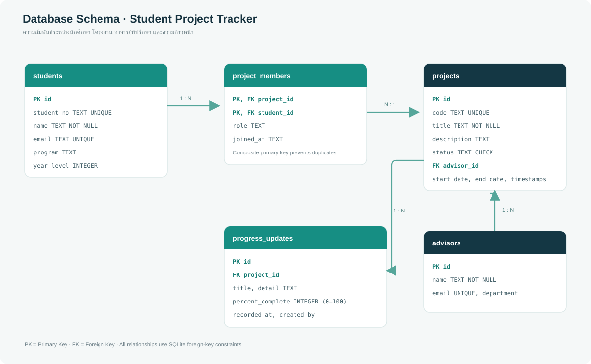

# ระบบจัดการโครงงานนักศึกษา (Project Hub)

เว็บแอปตัวอย่างสำหรับงานปฏิบัติวิชา 416105 การประยุกต์ใช้เทคโนโลยีเว็บและแพลตฟอร์ม ระบบมีหน้าเว็บสำหรับดู/ค้นหา/เพิ่ม/แก้ไข/ลบโครงงาน, REST API, ฐานข้อมูล SQLite และข้อมูลตัวอย่างสังเคราะห์

> **ก่อนส่งงานกลุ่ม:** เติมชื่อสมาชิกจริง 3–4 คนและแบ่งหน้าที่ในส่วน “สมาชิกกลุ่ม” ด้านล่าง ข้อมูลนักศึกษาและอาจารย์ที่เห็นในระบบเป็นข้อมูลตัวอย่าง ไม่ใช่รายชื่อสมาชิกจริง

## สมาชิกกลุ่ม

| สมาชิก | รหัสนักศึกษา |
|---|---|
| นายกันตภณ สมทรัพย์ | 6740215105 |
| นายธนภัทร ศุภวัชโรบล | 6740215115 |
| นายศุภโชค อุเทนสุต | 6740215126 |
| นายภาคิน อาวรจิตร | 6740215123 |
| นายชลธาร โปทา | 6740215108 |

## เทคโนโลยี

- **Frontend:** HTML, CSS และ JavaScript แบบไม่ใช้ framework
- **Backend:** Node.js HTTP server
- **Database:** SQLite ผ่าน `node:sqlite` (ไม่ต้องติดตั้งแพ็กเกจเพิ่ม)
- **API:** REST, JSON, HTTP status codes

## เริ่มใช้งาน

ต้องใช้ Node.js 22.5 ขึ้นไป (แนะนำ Node.js 24) เนื่องจากใช้โมดูล SQLite ที่ติดมากับ Node.js

```bash
npm start
```

เปิด `http://127.0.0.1:8765` ในเบราว์เซอร์ เซิร์ฟเวอร์จะสร้างฐานข้อมูล `data/project_tracker.sqlite` และข้อมูลตัวอย่างให้อัตโนมัติเมื่อเปิดครั้งแรก ไม่ต้องรัน `npm install`

## ฟังก์ชันที่ทำได้

- แสดงรายการโครงงาน พร้อมสถานะ ความก้าวหน้า อาจารย์ที่ปรึกษา และจำนวนสมาชิก
- ค้นหาด้วยชื่อหรือรหัสโครงงาน และกรองตามสถานะ
- เพิ่ม/แก้ไข/ลบโครงงานจากฟอร์มบนหน้าเว็บ
- ดูข้อมูลอาจารย์ นักศึกษา สมาชิก และบันทึกความก้าวหน้าผ่าน API
- ตรวจสอบการเชื่อมต่อฐานข้อมูลที่ `GET /api/health`
- ทดลอง API ผ่านเมนู “ทดสอบ API” หรือรันสคริปต์ด้านล่าง

## ฐานข้อมูล

มี 5 ตารางตามโจทย์: `students`, `projects`, `advisors`, `project_members`, `progress_updates` โดยตาราง `project_members` แทนความสัมพันธ์หลายต่อหลายระหว่างนักศึกษากับโครงงาน ตาราง `projects` อ้างอิงอาจารย์ที่ปรึกษา และ `progress_updates` เก็บประวัติความก้าวหน้าของแต่ละโครงงาน



รายละเอียดคอลัมน์และความสัมพันธ์อยู่ใน [`src/schema.sql`](src/schema.sql) และ [`docs/api-examples.md`](docs/api-examples.md)

## REST API

| Method | Endpoint | คำอธิบาย |
|---|---|---|
| GET | `/api/projects` | ดูโครงงานทั้งหมด รองรับ `?q=` และ `?status=` |
| GET | `/api/projects/{id}` | ดูโครงงานรายรายการ พร้อมสมาชิกและประวัติความก้าวหน้า |
| POST | `/api/projects` | เพิ่มโครงงาน |
| PUT | `/api/projects/{id}` | แก้ไขโครงงาน |
| DELETE | `/api/projects/{id}` | ลบโครงงาน |
| GET | `/api/health` | ตรวจสถานะเซิร์ฟเวอร์และฐานข้อมูล |
| GET | `/api/advisors` | ดูอาจารย์ที่ปรึกษา |
| GET | `/api/students` | ดูนักศึกษา |
| GET | `/api/projects/{id}/members` | ดูสมาชิกของโครงงาน |
| GET | `/api/projects/{id}/progress` | ดูประวัติความก้าวหน้า |
| POST | `/api/projects/{id}/progress` | เพิ่มบันทึกความก้าวหน้า |

ตัวอย่าง JSON Request/Response อยู่ใน [`docs/api-examples.md`](docs/api-examples.md)

## ทดสอบ API

1. เปิดเซิร์ฟเวอร์ด้วย `npm start`
2. ในอีกหน้าต่างหนึ่งรัน `npm run test:api`
3. เปิด `http://127.0.0.1:8765/api-tests` เพื่อทดสอบจากหน้าเว็บและดูผลบนตาราง

สคริปต์ทดสอบจะบันทึกผลลง `evidence/api-test-results.json` และสร้างรายงานภาพ `evidence/api-test-report.svg` โดยลบโครงงานทดสอบชั่วคราวหลังทดสอบ ตารางกรณีทดสอบและผลที่คาดหวังอยู่ใน [`docs/test-plan.md`](docs/test-plan.md) รายงานภาพเป็นสรุปผลจากสคริปต์ ไม่ใช่ภาพหน้าจอจริง; หน้าทดสอบแบบโต้ตอบอยู่ที่ `/api-tests` และใช้จับภาพหน้าจอส่งงานได้

## ความถูกต้องและความปลอดภัย

- ใช้ prepared statements กับคำสั่ง SQL ที่รับข้อมูลจากผู้ใช้
- ตรวจข้อมูลบังคับ, รูปแบบวันที่, สถานะ, advisor ID และช่วงเปอร์เซ็นต์ความก้าวหน้าก่อนบันทึก
- ป้องกันรหัสโครงงานซ้ำด้วย unique constraint และตอบ `409 Conflict`
- เปิดเซิร์ฟเวอร์ที่ `127.0.0.1` ตามค่าเริ่มต้น เหมาะกับการสาธิตในเครื่อง
- ลบความคืบหน้า/สมาชิกที่ผูกกับโครงงานโดย foreign-key cascade เมื่อโครงงานถูกลบ
- ใช้ข้อมูลตัวอย่างสังเคราะห์และอีเมลโดเมน `.example.test`

## GitHub Repository

Repository: [https://github.com/boom99adwa/student-project-tracker-416105](https://github.com/boom99adwa/student-project-tracker-416105)

Repository นี้ตั้งเป็น Public เพื่อให้อาจารย์เปิดตรวจจากลิงก์ได้

## โครงสร้างไฟล์

```text
ProjectTracker/
├── data/project_tracker.sqlite  # ฐานข้อมูลพร้อมข้อมูลตัวอย่าง
├── docs/                        # ตัวอย่าง API และแผนทดสอบ
├── evidence/                    # ผลการทดสอบ API
├── public/                      # หน้าเว็บและ ER Diagram
├── scripts/api-smoke.mjs        # สคริปต์เรียก API จริง
└── src/                          # REST API และ schema SQLite
```
